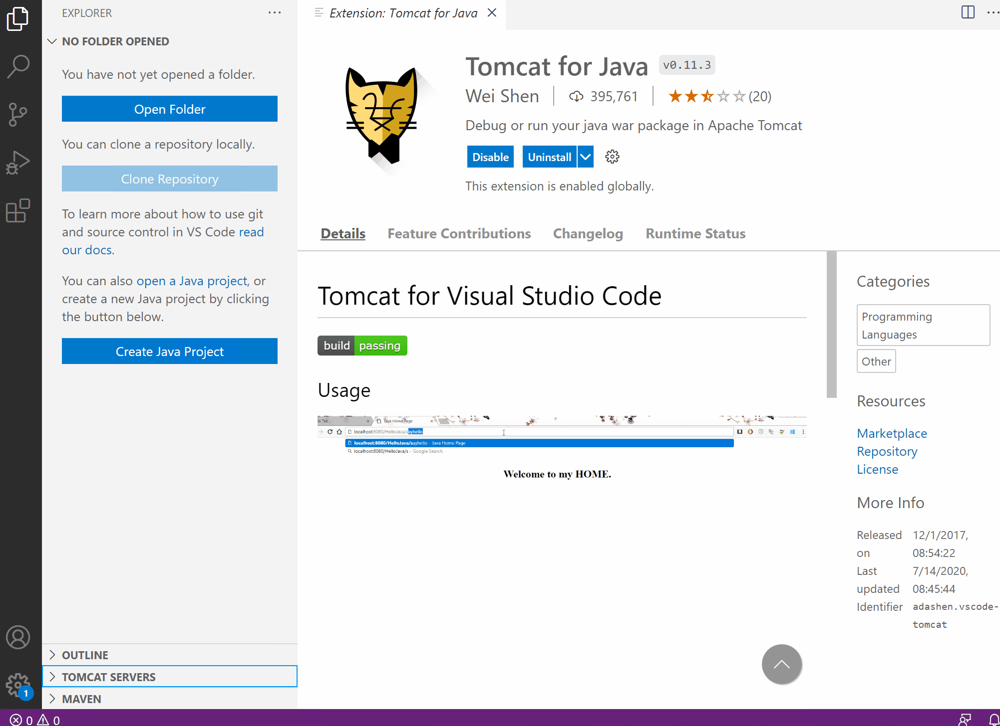

# Local Tomcat & Docker Deployment
### Pre-requisites
* [VS Code Java Coding Pack](https://code.visualstudio.com/docs/languages/java#_install-visual-studio-code-for-java)
### Testing the .war Locally
1. Install the [Tomcat for Java](https://marketplace.visualstudio.com/items?itemName=adashen.vscode-tomcat) VS Code Plugin.

2. [Download Tomcat 9](https://tomcat.apache.org/download-90.cgi) to your local machine & unzip to your prefered directory.

3. Add Tomcat to VS Code & Start the Server

4. Right Click your ROOT.war & select Run on Tomcat Server
### Pre-requisites

* [Docker CLI](https://docs.docker.com/install/)

### Building with Docker

1. Clone the repository and navigate into the root of the repository:

1. Build the docker image:

    ```bash
    docker build -t dockertomcat:01 .
    ```

1. Run the image:

    ```bash
    docker run -d -p 8080:8080 dockertomcat:01
    ```

1. Once the container is running, navigate to `http://localhost:8080`

